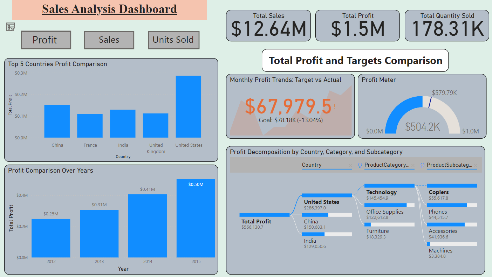
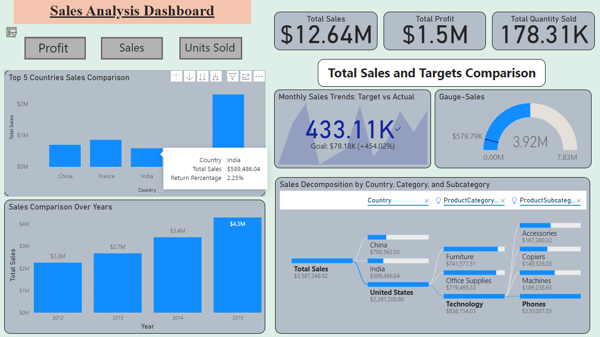
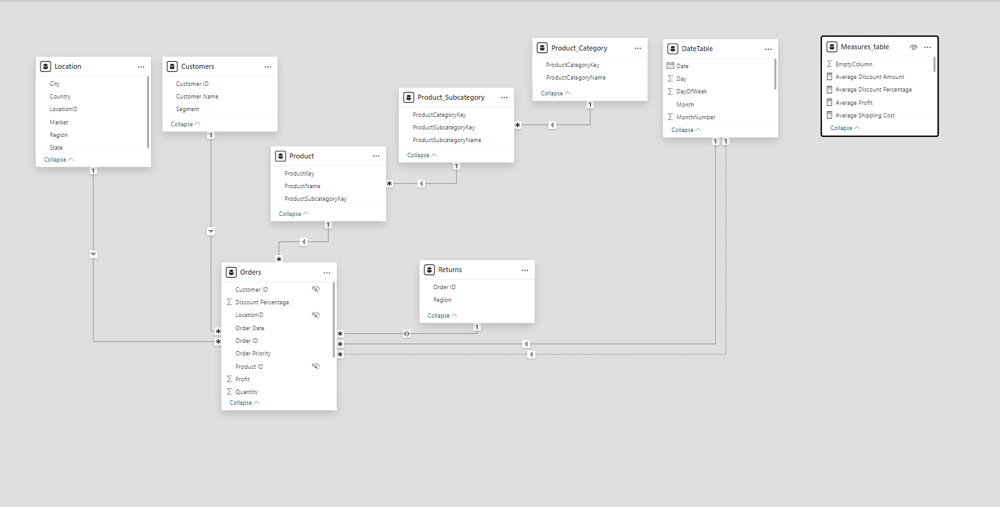

# Sales Data Analysis Project

This project focuses on analyzing sales data using Python, relational database concepts, and Power BI to derive insights and make informed business decisions.

## Overview

The project involves the following steps:

1. **Data Cleaning and Preprocessing**: Initially, raw sales data is cleaned using Python. This involves handling missing values, removing duplicates, and ensuring data consistency.

2. **Data Normalization**: The cleaned data is then structured into 5-6 tables to reduce redundancy and organize it efficiently for a relational database schema.

3. **Power BI Integration**: The preprocessed data is uploaded into Power BI for further analysis. This step involves connecting the data sources and organizing them into a coherent dataset.

4. **Data Analysis and Visualization**: In Power BI, various measures and calculated columns are created to derive meaningful insights from the data. Additionally, a separate date table is generated to facilitate time-based analysis.

5. **Dashboard Creation**: Finally, a comprehensive dashboard is designed in Power BI to visualize and analyze the sales data effectively. This dashboard provides stakeholders with actionable insights and helps in making informed business decisions.

## Project Structure

- `data/`: Contains the raw and preprocessed sales data files.
- `scripts/`: Python scripts used for data cleaning, normalization, and preprocessing.
- `power_bi/`: Power BI files (.pbix) containing the integrated dataset and dashboard.
- `images/`: Contains screenshots of Power BI dashboards and the Entity-Relationship Diagram (ERD) model.

## Usage

1. **Data Preprocessing**: Execute the Python scripts in the `scripts/` directory to clean and preprocess the sales data.

2. **Power BI Integration**: Open the Power BI files in the `power_bi/` directory to connect the data sources and create visualizations.

3. **Dashboard Analysis**: Explore the dashboard in Power BI to gain insights into the sales data and make data-driven decisions.

## Screenshots

### Dashboard - Profit

### Dashboard - Sales

### Dashboard - Units Sold

### Entity-Relationship Diagram (ERD)

## Contributors

- [Your Name](https://github.com/yourusername)

## License

This project is licensed under the [MIT License](LICENSE).
